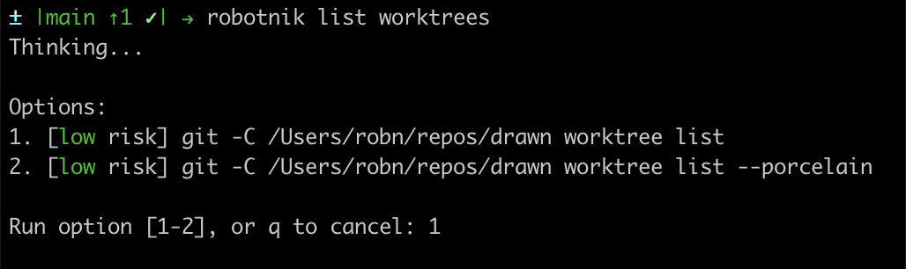

# Robotnik

Robotnik is a small CLI that turns a natural-language shell request into a short menu of command options, labels each option with a local risk level, and only runs the command you select.

It uses an AI command to generate candidate shell commands, then applies its own local safety checks before execution. By default it uses the Codex CLI in read-only, non-interactive mode.



## Install With Bash

Copy and paste this command:

```bash
curl -fsSL https://raw.githubusercontent.com/walrusk/robotnik/main/install.sh | bash
```

The installer downloads the latest Bash `robotnik` script and installs it as `robotnik` in a user-writable bin directory. It prefers a writable directory that is already on your `PATH`, otherwise it installs to `~/.local/bin` and prints the `PATH` line to add to your shell profile.

To install somewhere specific:

```bash
curl -fsSL https://raw.githubusercontent.com/walrusk/robotnik/main/install.sh | ROBOTNIK_INSTALL_DIR="$HOME/bin" bash
```

To pin an install to a branch, tag, or commit:

```bash
curl -fsSL https://raw.githubusercontent.com/walrusk/robotnik/main/install.sh | ROBOTNIK_REF=main bash
```

## Install With Go

If you have Go installed, you can install the Go implementation instead:

```bash
go install github.com/walrusk/robotnik/cmd/robotnik@latest
```

Go installs the binary into `GOBIN`, or `GOPATH/bin` when `GOBIN` is unset. Make sure that directory is on your `PATH`.

To install from the current main branch instead of the latest tagged version:

```bash
go install github.com/walrusk/robotnik/cmd/robotnik@main
```

## Requirements

- Bash implementation: Bash and `jq`
- Go implementation: Go to install from source
- Both implementations: Codex CLI, unless you set `ROBOTNIK_AI_CMD`

Robotnik's default AI backend is:

```bash
codex exec --ephemeral --sandbox read-only --color never -c approval_policy="never" -c model_reasoning_effort="medium"
```

## Usage

```bash
robotnik show the largest files under this repo
robotnik delete all branches except for the current one and main
```

Robotnik prints command options and waits for you to pick one:

```text
Options:
1. [low risk] find . -type f -maxdepth 3 -print
2. [low risk] rg --files

Run option [1-2], or q to cancel:
```

Commands labeled `max` are refused unless you pass `--allow-max`.

```bash
robotnik --allow-max delete old local branches
```

## Configuration

Set `ROBOTNIK_AI_CMD` to use a different generator.

The command receives Robotnik's full prompt on stdin and must print JSON in this shape:

```json
{
  "options": [
    {
      "title": "short label",
      "command": "single-line bash command",
      "notes": "brief caveat"
    }
  ]
}
```

Example:

```bash
ROBOTNIK_AI_CMD='my-command-generator --json' robotnik list recent git branches
```

## Uninstall

Remove the installed executable:

```bash
rm -f "$HOME/.local/bin/robotnik"
```

If you installed to a custom directory, remove `robotnik` from that directory instead.
